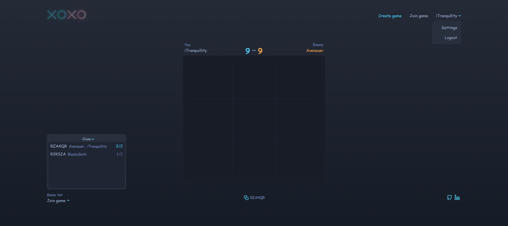

# TicTacToe - Multiplayer Game
Simple game created with .NET, REACTJS, EFCore, with identity, sqlite and tailwind.

## Table of Contents
- [General info](#general-information)
- [Technologies Used](#technologies-used)
- [Features](#features)
- [Screenshots](#screenshots)
- [Setup](#setup)
- [Status](#status)
- [Room for Improvement](#room-for-improvement)
- [Acknowledgements](#acknowledgements)

## General information
 It started as a simple tic-tac-toe game project, but I would love to expand this idea and introduce more games.

The main goal was to carry out a project that would allow me to learn with a mentor many aspects of software development and I can proudly say that it did teach me just how much room there is to grow. Since it started, I've systematized my knowledge of C# and .NET, started using relational databases, and developed REST API. Working with it allowed me to try many things like: sending the user's choice and its handling on the back side, receiving by the second user what the first did, displaying changes on the fly for both sides. I also started working with EntityFramework, and I'm learning the whole idea behind ORM. I am also trying to keep my code neat and clean.

I chose the tic-tac-toe game because it also seemed like a good way to try frontend: learning JavaScript, ReactJS, and CSS, and recently I also added Tailwind to help me with styling.

This project allows me to pursue my passion and develop myself. At the moment it's fairly simple, but there is a lot more I've got on my todo list like changing HTTP requests to WebSockets for real time communication or replacing cookie authentication with JWTs.

## Technologies Used
- .NET 6.0
- SQLite
- ReacJS
- EFCore

## Features
- Private/Public game
- Register
- History of games
- Invite link

#### To Do:
- Finish frontend
- Timer for move
- Spectators
- Statistics
- User avatar
- Play versus bots
- Tournament
- More games :)

## Screenshots


## Setup
To run this project, install it locally using npm:

```
$ cd ../Frontend
$ npm install
$ npm start
```


## Usage
If u want get by GameCode game for joining, to check game/rematch/close game, u can use: 
`_gameService.GetGameByGameCode(gameCode)`

## Status
###  _in progress_ 
####
At this point, Back is almost finished. I have to make more xunit tests, and clean a little bit code, make some features like timer.
Frontend design is almost finished, but for now, I have to connect it with back.

## Room for Improvement
- Diagonal win check

#### To Do:
- Finish frontend
- Timer for move
- Spectators
- Statistics
- User avatar
- Play versus bots
- Tournament
- More games :)

## Acknowledgements
Thank you:   
- my mentor [@blackyseth](https://github.com/kubaruczynski) who taught me almost everything :)
- for help with UI design and graphics for [@avenauer](https://github.com/avenauer)
